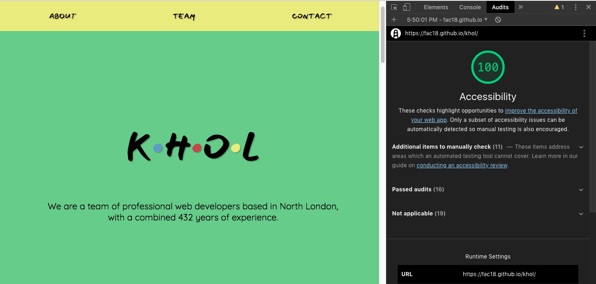

# khol. 

## Team:
 * [Ayub](https://github.com/Ayub3). 
 * [Jamie](https://github.com/jc282)
 * [Nikke](https://github.com/nikkesan)
 * [Renata](https://github.com/renatajarmova)

## Contents: 
* A headline and description about our team and what we offer.
* navigation button for About, team and contact.
* A contact form at the bottom of the page.

## The purpose of our site:

* To be able to easily access the all aspects if the website using.  
* You should easily be able to access all the contents on a mobile phone, tablet or a desktop. 
* our site should be easily accessible for visually impaired users, so that they can easily read the text.  
* our site should be easily accessible for our blind users so that they are able to easily naviagte throught the website using a screen reader. 

## Our process 
 * update the README.md with all our changes.  
 * create a HTML outline. 
 * create a Nav bar.
 * style the page.
 * make the website responsive for all users. 
 * added images of ourselves to our page. 
 * add a scroll of top botton. 
 * hide the return to top button if javascript is disabled.
 
 #### Our stretch goals:
- [x] added a return to top button
- [x] we added icons for github,linkedin and codewars

## Problems:
 * At first following the git workflow.
 * The profile article for all the profiles are different heights.
 
 ### what we have learned:
 * We all learned the git workflow
 * we learned how to use flex-box 
 
 ## User stories: 
we have satifised the following user stories:

 - [x] I want to visit your site and immediately see a headline about your team. So that I get a concise description of what you have to offer me.

- [x] I want to visit your site and see a navigation link for 'About, Team, and Contact', so I can quickly navigate to the areas of the site I'd like to visit.

- [x]  I want to be able to contact the developers by filling out and submitting a form by providing my name, email and message information. So that the team have sufficient information to contact me afterwards

- [x]  I want to click on a navigation link and a corresponding section be made visible in the browser window on the same page. So that I can quickly navigate around the site without having to wait for new pages to be loaded.

- [x] I want to easily view the site when browsing on my mobile, tablet or desktop
so that I can understand the sites content easily on whatever device I choose to view it in.

## Accessibility screenshot:

